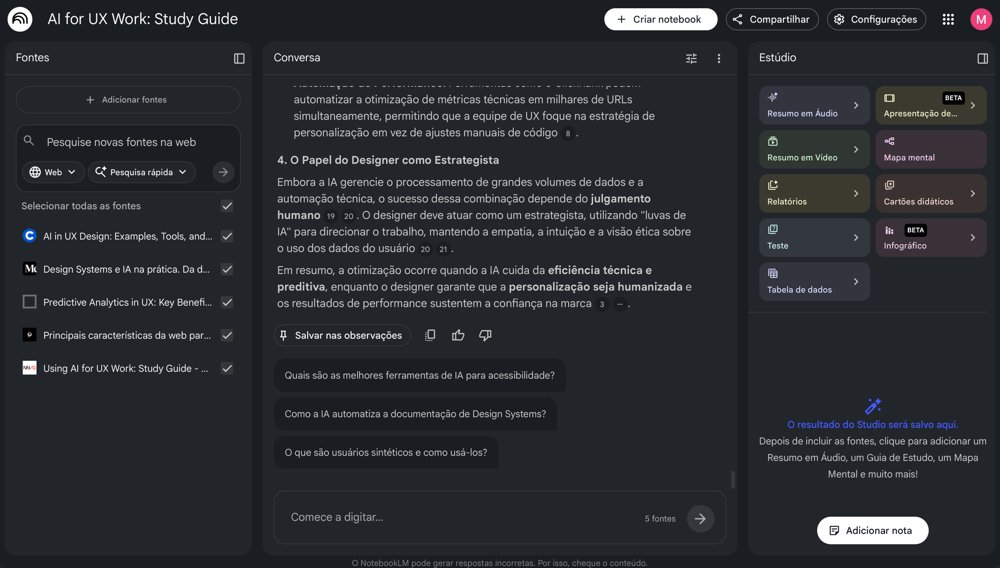

# 📘 Caderno Temático: IA como ferramenta de aprendizagem aplicada à UX em produtos digitais

---

## 🎯 Contexto e Objetivos

Este projeto explora o uso da Inteligência Artificial como ferramenta de aprendizagem aplicada à experiência do usuário (UX) em produtos digitais.

O estudo foi desenvolvido a partir de cenários práticos, com foco em plataformas de compra e venda de ingressos (cinema, shows e eventos), onde a experiência do usuário está diretamente relacionada a métricas como conversão, retenção e eficiência da jornada.

A proposta integra conceitos de experiência do usuário com fundamentos técnicos de desenvolvimento de sistemas, buscando compreender como tecnologia, dados e design se conectam na construção de produtos digitais mais eficientes.

Objetivos específicos:
- Explorar o uso da IA como apoio ao aprendizado e análise  
- Compreender como UX impacta métricas de produto  
- Investigar aplicações de personalização e previsão de comportamento  
- Desenvolver pensamento crítico na utilização de IA  
- Consolidar um material de estudo com foco em aplicação prática  

---

## 📸 Demonstração do Projeto

Aqui está um registro da interface do NotebookLM utilizada para a curadoria e análise das fontes técnicas:

---

## 📚 Curadoria de Fontes

As fontes foram selecionadas para cobrir fundamentos de UX, aplicações de IA e aspectos técnicos de produto digital.

| Fonte (Artigo/Guia) | Organização | Assunto Principal |
| :--- | :--- | :--- |
| **[AI for UX: Study Guide](https://www.nngroup.com/articles/ai-work-study-guide/)** | Nielsen Norman Group | Fundamentos de UX e aplicação crítica de IA no design |
| **[AI in UX Design](https://www.coursera.org/articles/ai-in-ux-design)** | Coursera | Visão geral da IA aplicada ao fluxo de UX |
| **[Predictive Analytics in UX](https://www.uxpin.com/studio/blog/predictive-analytics-in-ux-key-benefits/)** | UXPin | Uso de dados para prever comportamento do usuário |
| **[Design Systems e IA na prática](https://brasil.uxdesign.cc/design-systems-e-ia-na-pratica-c34783d60e9e)** | UX Collective Brasil | Automação e escalabilidade de interfaces |
| **[Core Web Vitals para E-commerce](https://www.clickrank.ai/pt/core-web-vitals-for-ecommerce/)** | ClickRank | Performance e impacto direto na experiência do usuário |

Todas as fontes foram carregadas no NotebookLM para análise e exploração contextual baseada em IA.

---

## 🤖 Engenharia de Prompts e “Cicatrizes”

Para avaliar a qualidade das respostas geradas pela IA, foram considerados os seguintes critérios:

- Clareza e objetividade  
- Aplicação prática em produtos digitais  
- Uso de conceitos das fontes fornecidas  
- Profundidade da análise  

---

### 🔹 Prompt 1 (Genérico)

> Explique UX

📊 Resultado: resposta conceitual e bem estruturada, abordando pilares como fator humano, performance técnica, redução de fricção e fluxo de trabalho em UX.

⚠️ Limitação: apesar de completa, a resposta ainda é ampla e pouco direcionada a um contexto específico de produto digital.

💡 Aprendizado: prompts genéricos podem gerar boas explicações teóricas, mas com menor foco em aplicação prática.

---

### 🔹 Prompt 2 (Refinado)

> Explique UX em produtos digitais

📊 Resultado: resposta mais técnica e contextualizada, incluindo aspectos como Core Web Vitals, redução de fricção, design systems e personalização.

📈 Evolução: maior conexão com o contexto de produtos digitais e introdução de métricas e conceitos aplicáveis ao desenvolvimento.

⚠️ Limitação: ainda permanece em nível conceitual, sem aprofundar em cenários práticos.

💡 Aprendizado: adicionar contexto ao prompt melhora a qualidade técnica da resposta, mas ainda exige direcionamento para aplicação prática.

---

### 🔹 Prompt 3 (Direcionado)

> Como a IA pode melhorar a experiência do usuário em produtos digitais?

📊 Resultado: resposta estruturada e aplicada, abordando personalização, análise preditiva, otimização de performance, acessibilidade e automação.

📈 Evolução: introdução de aplicações práticas da IA ao longo do ciclo de desenvolvimento do produto.

💡 Aprendizado: direcionar o problema no prompt aumenta significativamente a utilidade e aplicabilidade da resposta.

---

### 🔹 Prompt 4 (Contextualizado com fontes)

> Com base nas fontes fornecidas, como a IA pode melhorar a experiência do usuário em plataformas digitais?

📊 Resultado: resposta consistente e bem estruturada, alinhada às fontes, abordando performance, personalização, design systems e integração entre design e desenvolvimento.

📈 Evolução: maior profundidade analítica, com uso de dados e melhor organização dos conceitos.

🚀 Destaque: introdução da IA como “copiloto estratégico” ao longo do ciclo de produto.

💡 Aprendizado: o uso de fontes melhora a precisão e a qualidade dos insights gerados.

---

### 🔹 Prompt 5 (Aplicado a produto)

> Como técnicas de predictive UX podem melhorar a conversão em plataformas de compra online?

📊 Resultado: resposta altamente aplicada, conectando UX preditiva a métricas como conversão, abandono de fluxo e valor médio do pedido.

📈 Evolução: forte alinhamento com cenários reais e impacto direto em resultados de negócio.

🚀 Destaque: UX tratada como elemento estratégico para crescimento.

💡 Aprendizado: cenários reais tornam as respostas mais acionáveis e orientadas a métricas.

---

### 🔹 Prompt 6 (Avançado e integrado)

> Considerando as fontes, como combinar personalização, predictive UX e métricas de performance para otimizar a experiência do usuário?

📊 Resultado: resposta estratégica e integrada, conectando experiência, comportamento do usuário e performance técnica.

📈 Evolução: consolidação de um pensamento sistêmico, considerando equilíbrio entre múltiplos fatores.

🚀 Destaque: análise de trade-offs entre personalização e performance.

💡 Aprendizado: prompts mais complexos permitem explorar relações entre conceitos e gerar respostas mais próximas de cenários reais.

---

## 🧠 Dificuldades Encontradas

- Respostas amplas quando o contexto era insuficiente  
- Necessidade de maior precisão na construção dos prompts  
- Desafio inicial em transformar teoria em aplicação prática  
- Dependência da qualidade das fontes para aprofundamento das respostas  

---

## 📊 Conexão com Métricas de Produto

As melhorias de UX apoiadas por IA impactam diretamente indicadores de negócio, como:

- Taxa de conversão  
- Taxa de abandono  
- Tempo de sessão  
- Retenção de usuários  

Esses fatores reforçam o papel da experiência do usuário como elemento estratégico em produtos digitais.

---

## 📖 Miniguia de Estudo

### 🧾 Resumo Estruturado

A experiência do usuário (UX) em produtos digitais é um fator determinante para o sucesso de plataformas, especialmente em sistemas de compra de ingressos, onde a jornada precisa ser rápida, intuitiva e eficiente.

Nesse contexto, a Inteligência Artificial atua como um mecanismo de otimização contínua, permitindo que o sistema se adapte ao comportamento do usuário em tempo real.

Principais aplicações:

- **Personalização**: adaptação da experiência com base no comportamento do usuário  
- **Predictive UX**: antecipação de ações para reduzir esforço e fricção  
- **Otimização de jornada**: simplificação de fluxos e redução de abandono  
- **Design Systems com IA**: consistência e escalabilidade de interfaces  
- **Performance**: uso de métricas como Core Web Vitals para garantir qualidade técnica  

---

### 📚 Glossário

- **UX (User Experience)**: experiência do usuário ao interagir com um produto digital  
- **Personalização**: adaptação da interface com base em dados do usuário  
- **Predictive UX**: uso de dados para prever comportamento  
- **Machine Learning**: modelos que aprendem padrões a partir de dados  
- **Core Web Vitals**: métricas de performance que impactam a experiência  
- **Design System**: conjunto de padrões reutilizáveis  

---

### 🔁 Prompts Reutilizáveis

- “Explique [conceito] com exemplos práticos em produto digital”  
- “Como a IA pode melhorar [processo] em uma plataforma digital?”  
- “Analise a UX de um sistema de [tipo] e sugira melhorias”  
- “Com base nas fontes, sintetize os principais insights sobre [tema]”  
- “Proponha melhorias de UX com base em comportamento e dados”  

---

## 🧠 Aprendizados e Reflexões Críticas

O uso do NotebookLM evidenciou que a qualidade das respostas está diretamente relacionada à clareza dos prompts e à curadoria das fontes.

Principais aprendizados:

- Prompts específicos geram respostas mais úteis  
- O contexto influencia diretamente a profundidade da análise  
- A IA funciona melhor como apoio ao raciocínio do que como fonte isolada  
- A interpretação crítica do usuário é essencial para aplicação prática  

---

## 🔍 Considerações Finais

O desenvolvimento deste projeto reforça a importância de uma abordagem integrada entre tecnologia, dados e experiência do usuário na construção de produtos digitais.

A utilização de IA como ferramenta de aprendizagem demonstrou ser mais eficaz quando combinada com pensamento crítico, curadoria de fontes e aplicação prática em cenários reais.
